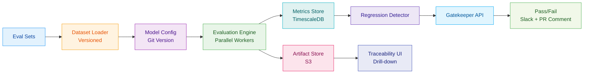

## Problem context & constraints

We needed to prevent regressions and unsafe outputs when updating prompts or swapping models in a customer-facing assistant. Requirements:

- **Deterministic:** Same inputs must produce identical evaluation scores across runs.
- **Reproducible:** Audit trails for every evaluation decision.
- **CI/CD integration:** Block PR merges if evals regress.
- **Multi-dimensional:** Not just accuracy—measure refusal correctness, calibration, and toxicity.
- **Speed:** Full eval run in under 20 minutes for 2k examples.

## Architecture

## Key design decisions & trade-offs

### Parallel eval workers
- **Decision:** Run evaluation shards in parallel (8 workers).
- **Why:** Reduced total eval time from 48m to 16m.
- **Trade-off:** Increased memory usage; mitigated by streaming results.

### Versioned datasets and configs
- **Decision:** Store eval sets and model configs in Git; tag releases.
- **Why:** Reproducibility and auditability.
- **Trade-off:** Larger repo size; acceptable for governance.

### Multi-metric gate
- **Decision:** Require pass on 3 of 4 metrics (accuracy, refusal correctness, calibration, toxicity).
- **Why:** Prevents optimization for a single metric.
- **Trade-off:** Slightly higher false-positive rate; tuned per product.

### Time-series metrics store
- **Decision:** Use TimescaleDB for metric history.
- **Why:** Enables drift detection and regression queries.
- **Trade-off:** More operational complexity vs flat files.

## Failure modes & mitigations

| Failure mode | Detection | Mitigation |
|--------------|------------|-------------|
| Eval worker crash | No results from shard | Auto-retry with exponential backoff; alert if >2 failures |
| Model flakiness | High score variance | Require 3 runs; use median |
| Dataset drift | Sudden metric drop | Auto-trigger dataset review |
| False positive gate | PR blocked incorrectly | Manual override with audit log |
| Metric leakage | Test data in training | Monthly data sanitization audit |

## Technologies used and why

- **Python:** Ecosystem support for ML/data tooling.
- **Pydantic:** Strict config validation for model/dataset metadata.
- **OpenAI SDK:** Consistent client for inference.
- **Pandas:** Tabular eval results and aggregations.
- **Plotly:** Interactive dashboards for metric trends.
- **TimescaleDB:** Efficient time-series for metric history.
- **S3:** Immutable artifacts with versioning.
