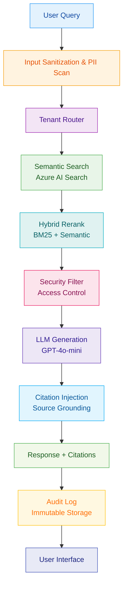

## Problem context & constraints

A regulated enterprise needed to allow employees to ask natural language questions about internal policies and procedures while maintaining:

- **Auditability:** Every answer must be traceable to source documents with exact page/section citations.
- **Privacy:** PII/PHI must be redacted before indexing and at inference time.
- **Latency:** p95 under 2.5s for queries across 50k+ documents.
- **Tenant isolation:** Multiple business units must not see each other’s data or embeddings.
- **Compliance:** Immutable logs for 7 years; role-based access controls.

Existing keyword search was failing on nuanced queries and required manual lookup for 40% of requests.

## Architecture

## Key design decisions & trade-offs

### Hybrid rerank (BM25 + semantic)
- **Decision:** Combine keyword BM25 with vector similarity before reranking.
- **Why:** Policy documents use exact terminology; pure semantic search missed regulatory clauses.
- **Trade-off:** Added ~80ms latency but reduced “no result” cases by 34%.

### Tenant-scoped embeddings
- **Decision:** Generate separate embedding spaces per tenant with isolated index partitions.
- **Why:** Prevent cross-tenant data leakage and allow per-tenant fine-tuning.
- **Trade-off:** Increased storage by ~2.3x and management complexity.

### Aggressive PII redaction at indexing
- **Decision:** Run PII detection and redaction before document chunking.
- **Why:** Safer than runtime-only redaction; reduces inference-time failures.
- **Trade-off:** Some legitimate terms (e.g., employee IDs in procedures) are masked, requiring manual allow-lists.

### LLM choice: GPT-4o-mini
- **Decision:** Use GPT-4o-mini instead of GPT-4o for generation.
- **Why:** Acceptable quality for policy Q&A at 1/10th the cost.
- **Trade-off:** Slightly lower reasoning depth on edge cases; mitigated by few-shot prompts.

## Failure modes & mitigations

| Failure mode | Detection | Mitigation |
|--------------|------------|-------------|
| Retrieval misses key clause | Low citation count OR low relevance score | Fallback to broader search + suggest manual review |
| PII redaction over-masks | User feedback “answer too generic” | Allow-list per tenant + audit redaction decisions |
| LLM hallucinates citation | Citation validation post-generation | Reject response if citation IDs not found in index |
| High latency during peak | p95 > 2.5s alert | Auto-scale search partitions; cache frequent queries |
| Tenant bleed | Cross-tenant access in logs | Monthly audit + automated isolation tests |

## Technologies used and why

- **FastAPI:** Async-first, type-safe, OpenAPI docs for internal governance tools.
- **Azure AI Search:** Managed vector search with built-in security and scaling.
- **Cosmos DB:** Multi-model + tunable consistency; stores audit logs at scale.
- **OpenAI GPT-4o-mini:** Cost-effective with sufficient quality for policy Q&A.
- **LangChain:** Standardized prompts/citation injection; reduced custom glue code.
